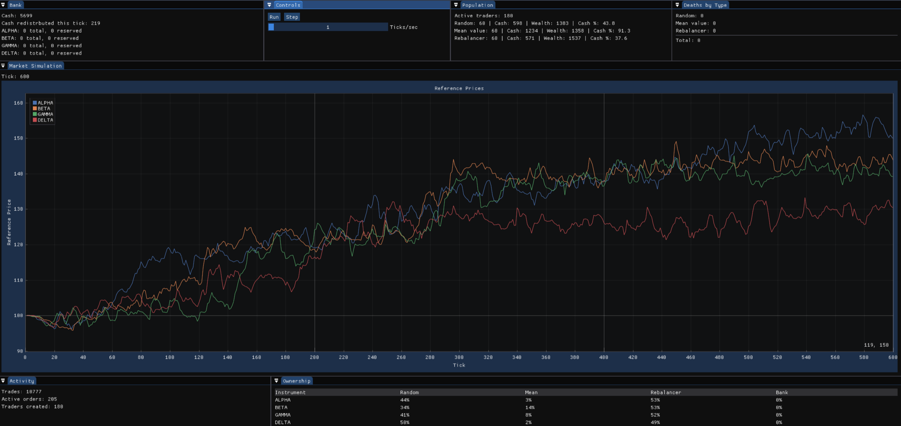

# Market Terrarium

[](https://github.com/Olympus204/Market-Terrarium/actions/workflows/ci.yml)

Market Terrarium is a C++20 agent-based artificial market built around price-time-priority limit order books.

The project models a closed market with finite cash and shares, then lets autonomous trader populations interact through buy, sell, cancel and wait decisions. The aim is not to reproduce a specific real market, but to provide a controlled experimental environment where different trading behaviours can produce emergent price, ownership, wealth, activity and survival dynamics.

The simulation can be explored interactively through a Dear ImGui / ImPlot dashboard or run headlessly in reproducible batches for larger experiments.



*Example run from symmetric initial conditions, showing emergent price divergence and ownership differences across trader strategies.*

## Current features

- Price-time-priority limit order books
- Multiple instruments with independent order books
- Seeded simulation runs for reproducible experiments
- Finite trader cash and share holdings
- Cash and share reservation for outstanding orders
- Immediate trade settlement
- Recurring trader costs
- Trader failure, liquidation and replacement
- A central bank/issuer that introduces shares and recycles excess cash
- Smoothed reference prices derived from executed trades
- Multiple autonomous trader strategies
- Headless batch experiments with CSV output
- Parallel execution of independent simulation runs
- Python-based analysis of experiment output
- Automated regression tests and GitHub Actions CI
- Interactive controls for pausing, stepping and changing simulation speed
- Dockable diagnostic windows showing:
  - price history
  - trader population
  - average cash and wealth by strategy
  - ownership by strategy
  - deaths by strategy
  - bank state
  - trade and order activity

## Trader strategies

### Random

Random traders choose stochastically between valid actions. They select instruments uniformly, quote around the currently observed price, and choose quantities within their available cash or holdings.

### Mean value

Mean-value traders compare the current observed price with a rolling historical mean. Their buy, sell and cancellation weights increase as the current price or resting order price moves further from that mean.

### Portfolio rebalancer

Portfolio rebalancers attempt to keep their wealth distributed evenly between cash and the available instruments. They account for outstanding orders when deciding what to buy, sell or cancel, and size orders toward the portfolio allocation they are trying to reach.

## Example experiment: transition to persistent trading

One experiment emerged from an unexpected behaviour in markets containing portfolio-rebalancing traders.

Markets populated entirely by portfolio rebalancers initially trade as agents redistribute their portfolios, but soon settle into a low-activity state. Introducing a small number of random traders produces a sharp transition toward persistent trading.

The experiment was repeated across several total population sizes and multiple random seeds, with each simulation running for 25,000 ticks. A run was classified as persistent if trading was still occurring during its final 1,000 ticks.

The transition shifts as the market population grows: larger markets require more random traders for persistent activity, but the required number appears to increase considerably more slowly than the total population.

This suggests that, within the current model, the transition is explained by neither a fixed absolute number of stochastic traders nor a fixed proportion of the population.

The result is a property of this deliberately simplified artificial market and is not intended as a claim about real financial markets. It provides a useful example of the kind of emergent behaviour the simulator is designed to investigate.

## Building

### Requirements

- A C++20 compiler
- CMake 3.20 or newer
- OpenGL
- GLFW 3
- Threads
- Ninja is optional, but used in the examples below

Dear ImGui and ImPlot are vendored in `external/`.

### Configure and build

```bash
cmake -S . -B build -G Ninja -DCMAKE_BUILD_TYPE=Release
cmake --build build
```

### Run the interactive simulator

```bash
./build/market_terrarium
```

### Run a headless batch experiment

```bash
./build/market_batch
```

Batch runs write experiment data to `results/` as CSV files.

### Run the tests

```bash
ctest --test-dir build --output-on-failure
```

The same build and test process is run automatically by GitHub Actions on pushes to `main` and on pull requests.

## Configuring experiments

Interactive simulation configuration currently lives in `src/main.cpp`, while larger headless experiments are configured in `src/batch.cpp`.

For example:

```cpp
Simulation sim{1001, 150000};

sim.add_instrument(1, "ALPHA", 100);
sim.add_instrument(2, "BETA", 100);
sim.add_instrument(3, "GAMMA", 100);
sim.add_instrument(4, "DELTA", 100);

sim.set_starting_amount(1000);
sim.set_recurring_costs(100, 100);

sim.introduce_holdings(1, 200);
sim.introduce_holdings(2, 200);
sim.introduce_holdings(3, 200);
sim.introduce_holdings(4, 200);

sim.set_bank_recycling(5000, 1, 0.25);

for (int i = 0; i < 30; ++i)
{
    sim.queue_trader(TraderType::random);
    sim.queue_trader(TraderType::mean_value);
    sim.queue_trader(TraderType::portfolio_rebalancer);
}
```

The first simulation argument is the random seed. Keeping the seed and initial conditions unchanged allows experiments to be repeated deterministically within the same environment.

Batch experiments can execute many independent seeded simulations concurrently and record aggregate and per-instrument statistics for later analysis.

## Analysing experiment output

Experiment results are written as CSV files and can be analysed using the scripts in `analysis/`.

The current analysis workflow uses Python with pandas, Matplotlib and Seaborn to compare repeated runs across population configurations and visualise quantities such as:

- persistence rate
- total trading activity
- final trade time
- price behaviour and volatility
- order-book activity
- trader wealth and cash
- ownership
- strategy survival

Keeping simulation and analysis separate allows the C++ executable to concentrate on running experiments quickly while Python handles exploratory statistics and visualisation.


*Persistence rate across random-trader populations for markets containing 45, 90, 135 and 180 total traders.*

## Project structure

```text
include/              Public headers for the market, traders, simulation and decisions
src/                  Core implementation, GUI entry point and batch runner
tests/                Order book, market, trader and simulation regression tests
analysis/             Python scripts for analysing experiment output
results/              Generated experiment CSVs
docs/                 Images and documentation assets
external/             Vendored Dear ImGui and ImPlot sources
.github/workflows/    Continuous integration configuration
```

The core simulation is built as the `market_core` library. The interactive GUI is kept in the separate `gui_support` target, while the test suite and headless experiment runner operate on the core simulation.

## Current limitations

Market Terrarium is intentionally simplified. In the current version:

- there are no company fundamentals or external news processes
- traders cannot short sell
- there are no dedicated market-maker or momentum strategies yet
- the bank is an artificial liquidity mechanism rather than a realistic financial institution
- reference prices are smoothed simulation values rather than an exchange-style official last price
- experiment configuration is currently compiled into the executables rather than loaded from external configuration files
- the model is designed for controlled experiments rather than direct simulation of a particular real financial market

These constraints make it easier to isolate behaviour generated by interactions between trader strategies.

### Planned directions

Future experiments may include momentum and market-making agents, company events, configurable latency costs, multiple markets, fraud-detection experiments, and populations of evolving or neural-network traders.

The longer-term goal is to use the terrarium as a controlled environment for asking how different strategy populations affect liquidity, volatility, ownership, survival and the emergence of higher-frequency behaviour.
